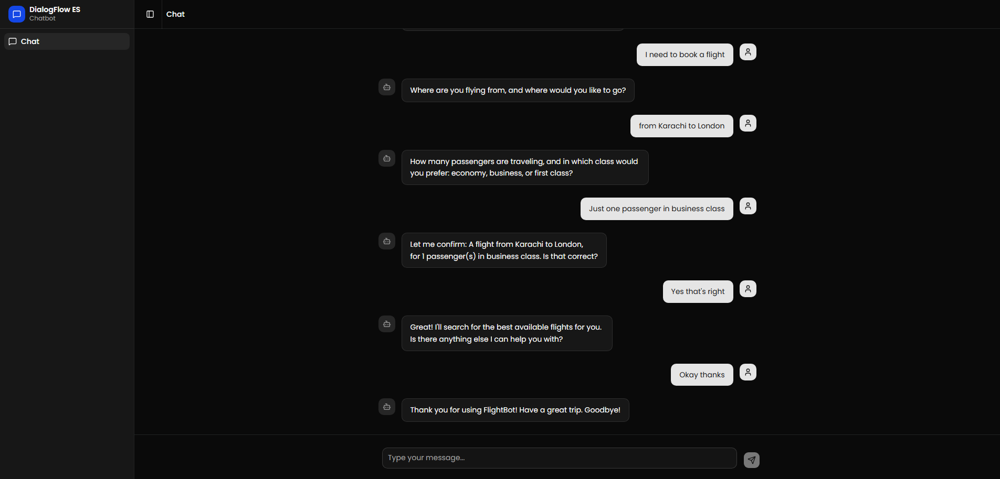
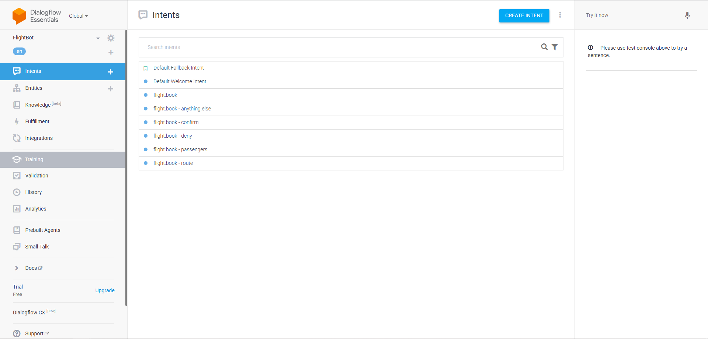

# Real-time Chat with Dialogflow ES

A real-time chat application where the frontend communicates with a NestJS backend over WebSocket. The server forwards user messages to **Google Dialogflow ES** via the REST API (`detectIntent`) and relays the fulfillment response back to the client.

## Architecture

```
┌─────────────┐   WebSocket (Socket.IO)    ┌─────────────┐   REST API (detectIntent)   ┌─────────────────┐
│  Next.js    │ ◄────────────────────────► │   NestJS    │ ◄─────────────────────────► │  Dialogflow ES  │
│  Chat UI    │   /chat namespace          │   Server    │   @google-cloud/dialogflow  │                 │
└─────────────┘                            └─────────────┘                             └─────────────────┘
```

### Message Flow

1. User sends a message from the chat UI.
2. Client emits `message` over Socket.IO (`/chat` namespace) with `message` and `sessionId`.
3. `ChatGateway` validates the payload and delegates to `ChatService`.
4. `DialogflowService` calls `SessionsClient.detectIntent()` and extracts `fulfillmentText`.
5. Server emits `response` (or `error`) back to the client over the same socket.
6. Client appends the bot reply to the conversation.

Session context is preserved via a `sessionId` stored in `sessionStorage` on the client (falls back to socket ID on the server).

## Tech Stack


| Layer      | Stack                                                      |
| ---------- | ---------------------------------------------------------- |
| **Client** | Next.js 16, React 19, Socket.IO client, Tailwind/shadcn UI |
| **Server** | NestJS 11, Socket.IO gateway, `@google-cloud/dialogflow`   |
| **Infra**  | Docker Compose (two services: `web` + `api`)               |


## Key Components

### Client (`client/`)


| File                                     | Role                                                                                           |
| ---------------------------------------- | ---------------------------------------------------------------------------------------------- |
| `hooks/use-socket.ts`                    | Socket.IO connection, event handlers (`message` / `response` / `error`), session ID management |
| `app/_components/chatbot.tsx`            | Chat state, sends user input via `sendMessage()`, renders message history                      |
| `app/_components/chatbot-input-area.tsx` | Message input with loading/disabled states                                                     |
| `app/_components/chatbot-messages.tsx`   | Scrollable message list                                                                        |


### Server (`server/`)


| File                                             | Role                                                                               |
| ------------------------------------------------ | ---------------------------------------------------------------------------------- |
| `chat/chat.gateway.ts`                           | WebSocket gateway on `/chat`; handles `message` events, emits `response` / `error` |
| `chat/chat.service.ts`                           | Orchestrates message validation and Dialogflow delegation                          |
| `chat/dialogflow.service.ts`                     | Dialogflow ES integration via `detectIntent` REST call                             |
| `common/adapters/socket-io.adapter.ts`           | CORS configuration for Socket.IO                                                   |
| `common/filters/http-client-exception.filter.ts` | Global HTTP error handling                                                         |


### WebSocket Events


| Event      | Direction       | Payload                                   |
| ---------- | --------------- | ----------------------------------------- |
| `message`  | Client → Server | `{ message: string, sessionId?: string }` |
| `response` | Server → Client | `string` (fulfillment text)               |
| `error`    | Server → Client | `{ message: string }`                     |


## Dialogflow ES Agent — FlightBot

The chat UI does not contain bot logic. All conversational intelligence lives in a **Dialogflow ES agent** trained as a flight-booking assistant. The NestJS server passes each user message to Dialogflow via `detectIntent`; Dialogflow matches the intent, resolves context, and returns `fulfillmentText`, which the server relays over WebSocket.

### Intents & Responses


| Intent                          | Trigger (examples)                                      | Bot Response                                                                                                          |
| ------------------------------- | ------------------------------------------------------- | --------------------------------------------------------------------------------------------------------------------- |
| **Default Welcome**             | Hi, Hello, Hey, Good morning                            | Hello! Welcome to FlightBot. I can help you book a flight. Would you like to get started?                             |
| **flight.book**                 | I need to book a flight, Book me a flight               | Where are you flying from, and where would you like to go?                                                            |
| **flight.book - route**         | From London to Calgary, Lahore to Dubai                 | How many passengers are traveling, and in which class: economy, business, or first class?                             |
| **flight.book - passengers**    | Just one passenger in economy, 2 passengers in business | Let me confirm: A flight from $origin to $destination, for $passengers passenger(s) in $class class. Is that correct? |
| **flight.book - confirm**       | Yes, Correct, Confirm                                   | Great! I'll search for the best available flights for you. Is there anything else I can help you with?                |
| **flight.book - deny**          | No, Incorrect, Let me correct that                      | No problem! Let's start over. Where are you flying from, and where would you like to go?                              |
| **flight.book - anything.else** | No that's all, Okay thanks, I'm good                    | Thank you for using FlightBot! Have a great trip. Goodbye!                                                            |
| **Default Fallback**            | Unrecognized input                                      | I'm sorry, I didn't quite understand that. Could you please rephrase? I'm here to help you book a flight.             |


### Entities


| Intent                   | Parameter               | Entity Type     | Example                        |
| ------------------------ | ----------------------- | --------------- | ------------------------------ |
| flight.book - route      | `origin`, `destination` | `@sys.geo-city` | London, Calgary                |
| flight.book - passengers | `passengers`            | `@sys.number`   | 1, 2                           |
| flight.book - passengers | `class`                 | `@sys.any`      | economy, business, first class |


### Context Chaining

Intents are chained with input/output contexts so Dialogflow tracks the booking step across turns. The client `sessionId` maps to a Dialogflow session; contexts are managed inside Dialogflow per session.

```
flight.book              → output: booking-started
flight.book - route      → input: booking-started      → output: route-collected
flight.book - passengers → input: route-collected      → output: passengers-collected
flight.book - confirm    → input: passengers-collected → output: booking-confirmed
flight.book - deny       → input: passengers-collected
flight.book - anything.else → input: booking-confirmed
```

### Sample Conversation

```
User: Hi
Bot:  Hello! Welcome to FlightBot...

User: I need to book a flight
Bot:  Where are you flying from, and where would you like to go?

User: From London to Calgary
Bot:  How many passengers and which class?

User: Just one passenger in economy class
Bot:  Let me confirm: London to Calgary, 1 passenger, economy. Correct?

User: Yes that's right
Bot:  Great! I'll search for the best available flights...

User: Okay thanks
Bot:  Thank you for using FlightBot! Have a great trip. Goodbye!
```

After all intents, entities, and contexts are configured, hit **Train** in the Dialogflow console before testing.

## Screenshots

**Chat Interface** — real-time WebSocket chat connected to the NestJS server:



**Dialogflow ES Agent** — FlightBot intents and training configuration in the Dialogflow console:



## Error Handling

- Empty messages are rejected on both client and server.
- WebSocket disconnects and connection failures surface via toast notifications.
- Dialogflow API failures are caught in `DialogflowService` and returned as `error` events to the client.
- A global `HttpExceptionFilter` handles REST endpoint errors.

## Setup

### Prerequisites

- Docker & Docker Compose
- Google Cloud service account JSON with Dialogflow API access
- A Dialogflow ES agent configured in your GCP project

### 1. Environment Files

Copy the example env files and fill in your values:

```bash
cp server/.env.example server/.env
cp client/.env.example client/.env
```

`**server/.env**`


| Variable                         | Description                                         |
| -------------------------------- | --------------------------------------------------- |
| `DIALOGFLOW_PROJECT_ID`          | Your GCP project ID                                 |
| `DIALOGFLOW_LANGUAGE_CODE`       | Agent language (default: `en`)                      |
| `GOOGLE_APPLICATION_CREDENTIALS` | Path to service account JSON (`./credentials.json`) |
| `CORS_ORIGINS`                   | Allowed frontend origin (`http://localhost:3000`)   |


`**client/.env**`


| Variable              | Description                                        |
| --------------------- | -------------------------------------------------- |
| `NEXT_PUBLIC_WS_URL`  | WebSocket server URL (`http://localhost:8000`)     |
| `NEXT_PUBLIC_API_URL` | REST API base URL (`http://localhost:8000/api/v1`) |


### 2. Google Credentials

Place your GCP service account key at `server/credentials.json`. This file is mounted into the API container at runtime.

### 3. Run

```bash

docker compose up --build
```


| Service         | URL                                                      |
| --------------- | -------------------------------------------------------- |
| Chat UI         | [http://localhost:3000](http://localhost:3000)           |
| API / WebSocket | [http://localhost:8000](http://localhost:8000)           |
| Swagger docs    | [http://localhost:8000/docs](http://localhost:8000/docs) |


## Demo Video

- https://drive.google.com/file/d/1Fpmw0FTCgZIonLcoHZMt6my2vdHCYgd7/view?usp=sharing